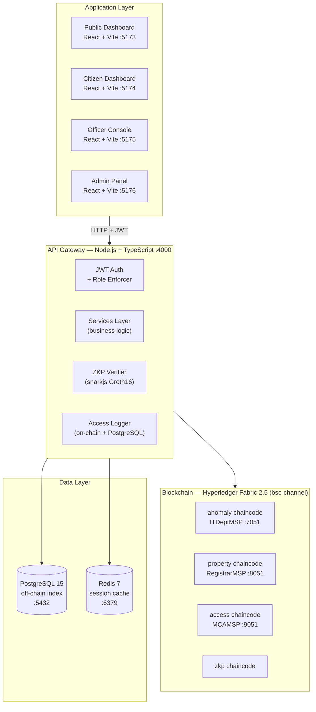

# System Overview

BSC is a three-layer system. Fabric is the source of truth. PostgreSQL is a fast read mirror. The API bridges them.

---

## Architecture Diagram



---

## Six-Step Data Flow

```
1. Citizen registers property  →  State land registry calls POST /properties
2. API validates + calls       →  property chaincode RegisterProperty
3. Chaincode writes record     →  Fabric ledger (MAJORITY endorsement: 2 of 3 orgs)
4. API dual-writes             →  PostgreSQL mirror for fast queries
5. Smart contract auto-runs    →  Compares value vs. declared income (anomaly check)
6. Flag raised if gap found    →  AnomalyFlag written to anomaly chaincode
```

---

## Design Principles

**Fabric is the source of truth.** PostgreSQL is a mirror for fast search. When they disagree, Fabric wins.

**No application talks to Fabric directly.** All chaincode calls go through the API gateway, which enforces JWT auth, role permissions, and access logging.

**Every access is logged.** Any time a non-citizen role reads citizen data, two log entries are written: one to the `access` chaincode (immutable) and one to PostgreSQL's `system_audit` table (queryable).

**MAJORITY endorsement.** All writes require 2 of 3 peer orgs (ITDeptMSP, RegistrarMSP, MCAMSP) to endorse the transaction. No single ministry can write to the ledger unilaterally.

**All monetary values in paisa.** `int64`, never floats. 1 INR = 100 paisa. This applies throughout the API, chaincodes, and database.

**All identifiers are 64-char hex SHA-256 hashes.** Never raw Aadhaar numbers, PAN numbers, or officer IDs.

---

## Components

| Component | Tech | Port | Role |
|---|---|---|---|
| Public Dashboard | React 19 + Vite + Tailwind | 5173 | Read-only public browsing |
| Citizen Dashboard | React 19 + Vite + Tailwind | 5174 | Self-service citizen view |
| Officer Console | React 19 + Vite + Tailwind | 5175 | Investigation + court/bank ops |
| Admin Panel | React 19 + Vite + Tailwind | 5176 | System management |
| API Gateway | Node.js + TypeScript + Express | 4000 | Business logic + chaincode bridge |
| anomaly chaincode | Go | — | CitizenNode records + auto anomaly rules |
| property chaincode | Go | — | PropertyRecord + court freeze/unfreeze |
| access chaincode | Go | — | Permission matrix + immutable access log |
| zkp chaincode | Go | — | Groth16 proof records + anti-replay |
| Fabric peer (IT Dept) | Hyperledger Fabric 2.5 | 7051 | Blockchain endorser |
| Fabric peer (Registrar) | Hyperledger Fabric 2.5 | 8051 | Blockchain endorser |
| Fabric peer (MCA) | Hyperledger Fabric 2.5 | 9051 | Blockchain endorser |
| Orderer | Hyperledger Fabric 2.5 | 7050 | Transaction ordering |
| PostgreSQL | PostgreSQL 15 | 5432 | Off-chain index + search mirror |
| Redis | Redis 7 | 6379 | Session cache (60s TTL) |

---

## Chaincode Versions

| Chaincode | Current | State key prefix |
|---|---|---|
| `anomaly` | v1.1 / seq 2 | `CITIZEN_<hash>`, `FLAG_<hash>_<txId[:8]>` |
| `property` | v1.1 / seq 2 | `PROP_<id>`, `TRANSFER_<id>_<txId>`, `CORDER_<orderId>` |
| `access` | v1.0 / seq 1 | `LOG_<citizenHash>_<txId>`, `PERM_<role>_<dataType>` |
| `zkp` | v1.1 / seq 2 | `ZKP_<proofId>`, `CLAIM_<citizenHash>_<claimId>` |
